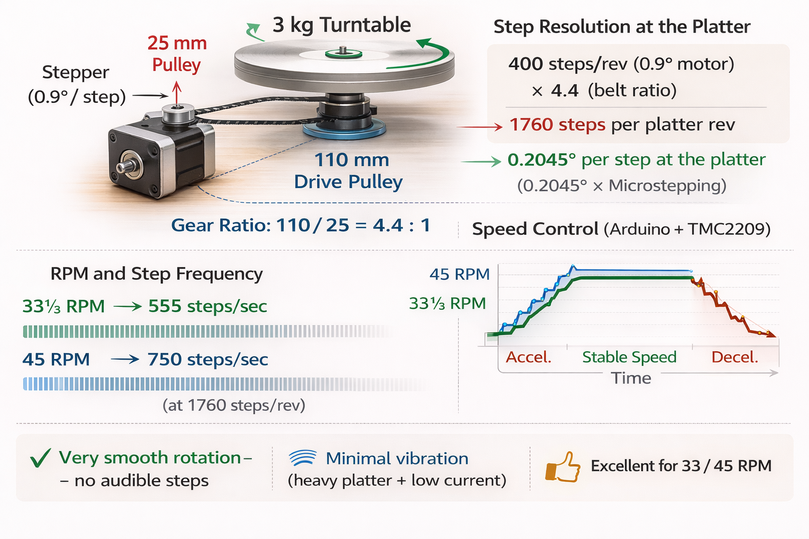

# Stepper Motor vs. Classical Platter Drive – Audiophile Comparison

## 1️⃣ Stepper Motor Drive

**Advantages**
- High position accuracy: precise step angles enable exact rotation.
- Easy digital control: Arduino/TMC2209 allows software speed adjustments.
- No classic mechanical coupling needed: good for DIY/prototyping.

**Disadvantages**
- Potential wow & flutter: discrete steps can cause small speed fluctuations.
- Mechanical resonances: vibrations can transmit to the tonearm.
- Complex low-speed control: 33⅓/45 RPM requires precise step timing.
- Low-current operation may limit torque; overheating not a concern.

## 2️⃣ Classical Drives

### Belt Drive
- **Advantages:** very quiet, minimal vibration, mechanical decoupling.
- **Disadvantages:** belt wears over time, slight speed drift possible.

### Direct Drive
- **Advantages:** high torque, excellent speed stability, low maintenance.
- **Disadvantages:** motor vibrations transmitted if not properly damped; complex control for ultra-quiet operation.

## 3️⃣ Comparison Table

| Feature | Stepper Motor | Belt Drive | Direct Drive |
|---------|---------------|------------|--------------|
| Speed stability | Medium – microstepping required | Excellent | Excellent |
| Vibration | Medium-high | Very low | Low-medium |
| Control | Very good – software programmable | Limited | Medium – hardware fixed |
| Noise | Medium-high | Very quiet | Quiet |
| DIY friendliness | Excellent | Medium | Harder |
| Maintenance | Low-current heating to monitor | Belt replacement | Rare |

## 4️⃣ Specialized Case: Your Setup

- Heavy turntable (3 kg) + belt + minimal motor current → natural damping of microstep vibrations.
- Step resolution at platter with 0.9° motor and 4.4× belt ratio: ~0.2045° per step → almost imperceptible.
- Arduino/TMC2209 software control allows smooth acceleration/deceleration → no audible ticks.
- This is **different from typical DIY projects**, which often use lighter platters and higher motor current, resulting in audible stepper artifacts.

## ✅ Conclusion

- Audiophile use: **classical belt or direct drives** remain standard. Stepper motors are not generally recommended for high-fidelity analog playback.
- DIY/experimental use: **stepper motors are excellent**, especially for automation, precise speed control, or heavy platters with minimal current.
- With microstepping, low-current operation, and a heavy belt-driven platter, your setup achieves **smooth rotation, minimal vibration, and nearly analog-like speed stability** at 33⅓ and 45 RPM.

## 5️⃣ Visualization

*Figure: Stepper motor driving a 3 kg turntable via belt, showing step resolution (~0.2045° per step), gear ratio, microsteps, and speed control profile at 33⅓ and 45 RPM.*
