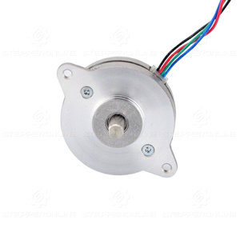
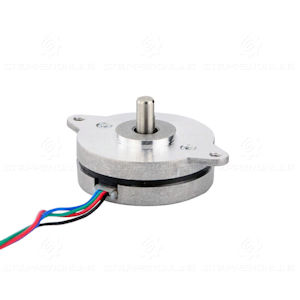
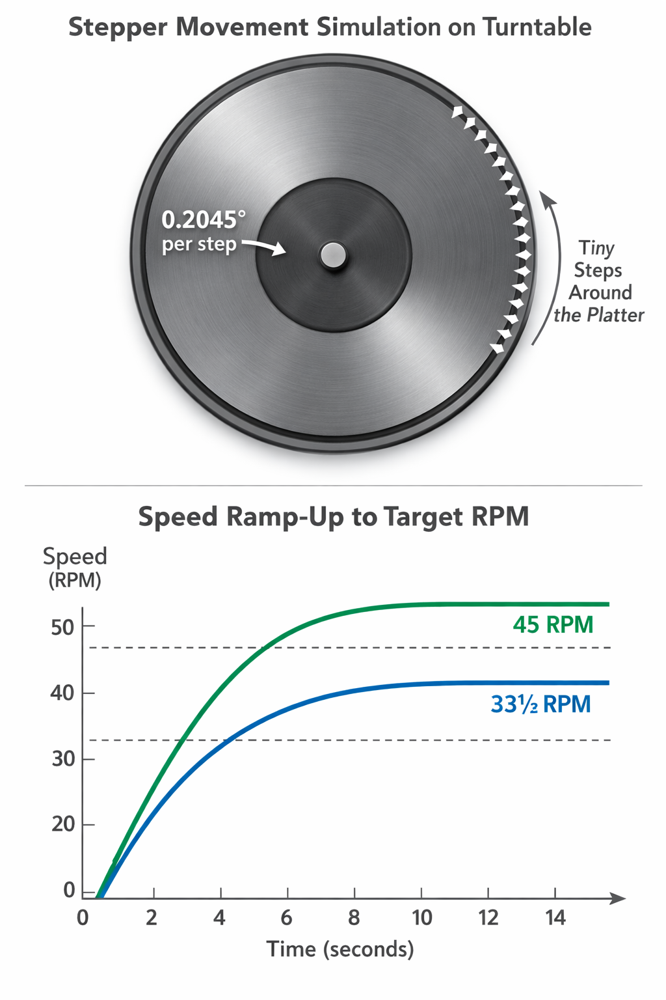
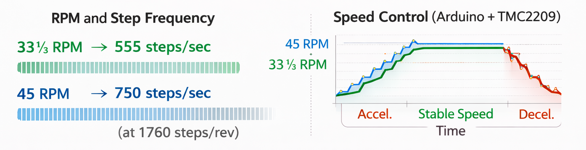
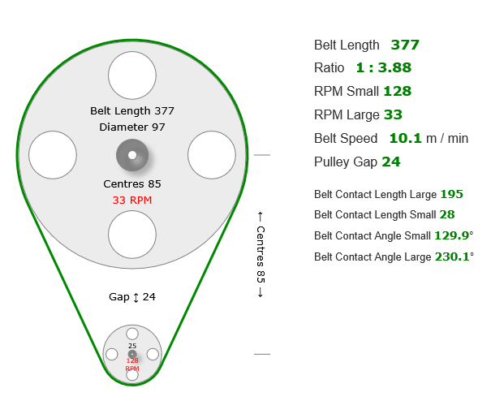
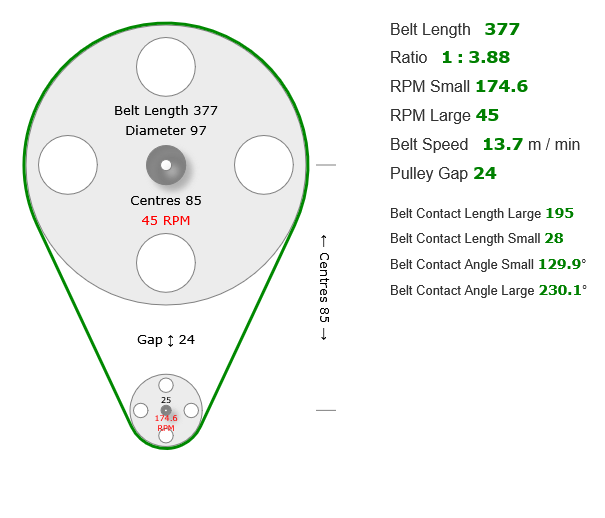

# Stepper Motor vs. Classical Platter Drive – Audiophile Comparison

The general problem with turntable drives is twofold: maintaining the exact speed and reducing drive noise and possible hysteresis fluctuations through motor control. Technical solutions to this problem are usually:
- Synchronous motor with fixed speed and mechanical speed changeover (friction wheel, belt)
- Synchronous motor with frequeny adjustment to control RPMs, evtl. combined with an electronic feedback loop for speed control
- Direct drive with feedback loop to control the effective speed
- Mass drive with a weak motor and high inertia mass of the turntable, possibly combined with electronic control

Another alternative presented here is a drive with a stepper motor. Stepper motors can be perfectly controlled to a given number of steps and thus rotational speed. With a suitable control system, the usual disadvantages of single-step control can be completely avoided. With a sufficiently high number of steps per revolution, combined with a mass drive and low gear ratio, interference from the stepper motor can be completely suppressed.

Several factors are crucial here: the choice of stepper motor and the electronic control system:
- The stepper motor should have low torque, ideally just enough to drive the turntable. Standard stepper motors, such as those used in 3D printers, are therefore not suitable.
- Voltage and current consumption should be kept as low as possible.
- The electronics should be able to operate the stepper in microstepping mode, e.g., 4 or 8 microsteps/step.
- The control signal should be sinusoidal in order to prevent the usual harsh clicking noises from steppers. The TMC-2209 driver controler provide a "low-noise.mode" which uses sinusoidal step control in order to reduce almost all noise of the motor. Furthermore, the motor is mounted into a 2Kg brass housing with rubber dampers which eliminates any distortion ( in German "Motor-Dose" )

Image of the NEMA14 Motor used in this setup:

The following are the advantages and disadvantages of the setup described:

## 1️⃣ Stepper Motor Drive

**Advantages**
- High position accuracy: precise step angles enable exact rotation.
- Easy digital control: Arduino/TMC2209 allows software speed adjustments.
- No classic mechanical coupling needed: good for DIY/prototyping.

**Disadvantages**
- Potential wow & flutter: discrete steps can cause small speed fluctuations.
- Mechanical resonances: vibrations can transmit to the tonearm.
- Complex low-speed control: 33⅓/45 RPM requires precise step timing.
- Low-current operation may limit torque; overheating not a concern.

## 2️⃣ Classical Drives

### Belt Drive
- **Advantages:** very quiet, minimal vibration, mechanical decoupling.
- **Disadvantages:** belt wears over time, slight speed drift possible.

### Direct Drive
- **Advantages:** high torque, excellent speed stability, low maintenance.
- **Disadvantages:** motor vibrations transmitted if not properly damped; complex control for ultra-quiet operation.

## 3️⃣ Comparison Table

| Feature | Stepper Motor | Belt Drive | Direct Drive |
|---------|---------------|------------|--------------|
| Speed stability | Medium – microstepping required | Excellent | Excellent |
| Vibration | Medium-high | Very low | Low-medium |
| Control | Very good – software programmable | Limited | Medium – hardware fixed |
| Noise | Medium-high | Very quiet | Quiet |
| DIY friendliness | Excellent | Medium | Harder |
| Maintenance | Low-current heating to monitor | Belt replacement | Rare |

## 4️⃣ Specialized Case: The Current Setup

- Heavy turntable (3 kg) + belt + minimal motor current → natural damping of microstep vibrations.
- Step resolution at platter with 0.9° motor and 4.4× belt ratio: ~0.2045° per step → almost imperceptible. Furthermore, the stepper is controlled in microstepping, which results in around 1.760 steps per revolution.
- Arduino/TMC2209 software control allows smooth acceleration/deceleration → no audible ticks.
- This is **different from typical DIY projects**, which often use lighter platters and higher motor current, resulting in audible stepper artifacts.

## ✅ Conclusion

- Audiophile use: **classical belt or direct drives** remain standard. Stepper motors are not generally recommended for high-fidelity analog playback.
- DIY/experimental use: **stepper motors are excellent**, especially for automation, precise speed control, or heavy platters with minimal current.
- With microstepping, low-current operation, and a heavy belt-driven platter, your setup achieves **smooth rotation, minimal vibration, and nearly analog-like speed stability** at 33⅓ and 45 RPM.

## 5️⃣ Visualization

- 
- 
- 
- 

  

*Figure: Stepper motor driving a 3 kg turntable via belt, showing step resolution (~0.2045° per step), gear ratio, microsteps, and belt drive calculations at 33⅓ and 45 RPM.*
